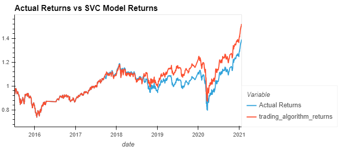
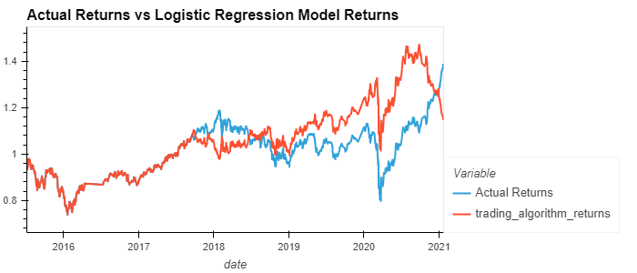

# FinTechM14Challenge
Module 14 Challenge work

This challenge uses an algorithmic trading system and enhance its model to make it adapt to new data
The steps for this Challenge are divided into the following sections:

* Establish a Baseline Performance
* Tune the Baseline Trading Algorithm
* Evaluate a New Machine Learning Classifier
* Create an Evaluation Report

## Technology
### Import the following libraries and modules

```
import pandas as pd
import numpy as np
from pathlib import Path
import hvplot.pandas
import matplotlib.pyplot as plt
from sklearn import svm
from sklearn.preprocessing import StandardScaler
from pandas.tseries.offsets import DateOffset
from sklearn.linear_model import LogisticRegression
from sklearn.metrics import classification_report
```
* [pandas](https://pandas.pydata.org/)
* [pathlib](https://docs.python.org/3/library/pathlib.html)
* [numpy](https://numpy.org/)
* [scikit-learn](https://scikit-learn.org/stable/modules/classes.html)

## Instructions
---
Run the file machine_learning_trading_bot.ipynb in a jupyter notebook

## Evaluation Report
---
In this challenge two predictive models were used to compare the model's accuracy in maximizing returns




The impact of using a different model is that the accuracy of the model decreased

## Contributors
---
### Sreedhar

## License
---
MIT
